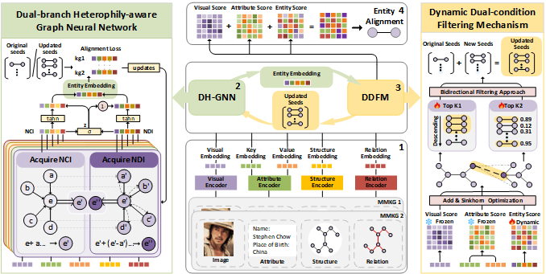

# DH-MEA
This is source code for the paper "Dual-Branch Heterophily-Aware Graph Neural Network with Seed Iterative Optimization for Multimodal Entity Alignment".

# Dependency
python-3.10

torch-2.6.0+cpu

torch-scatter-2.1.2+pt26cpu

scipy-1.15.3

tqdm-4.67.1

numpy-2.2.3

# Dataset
